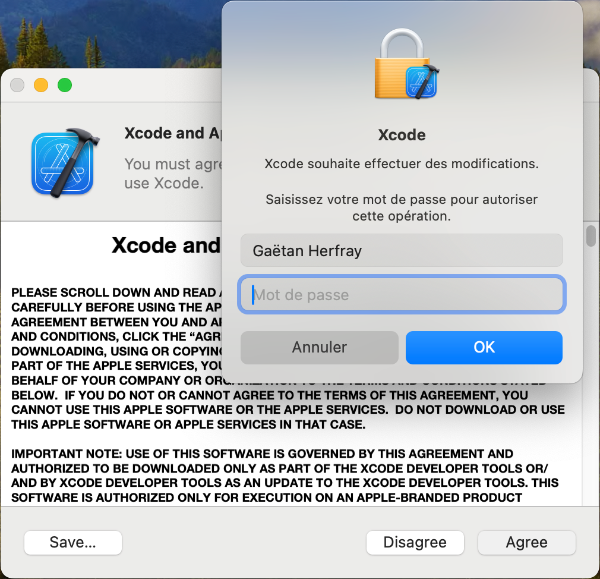
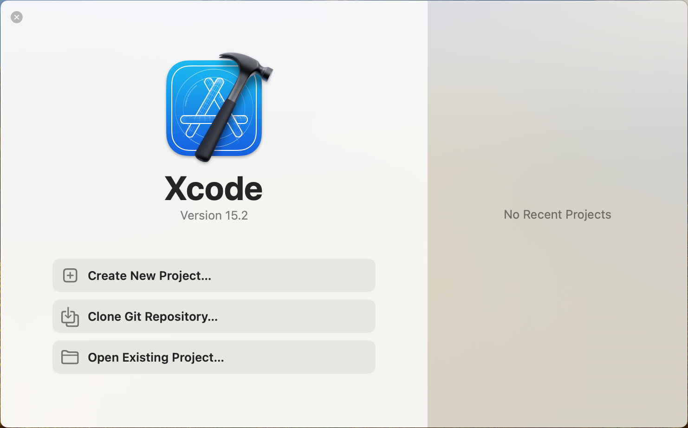

# Installation nécessaire de base

Cette installation de base décrit les étapes nécessaires à l'installation de
quelque outil que ce soit par la suite.

## Création des répertoires

### Discussion

Entre les bibliothèques, les fichiers exécutables et la gestion des
installations, il n'y aura malheureusement pas de solution parfaite pour gérer
les répertoires d'installation des différents outils. Voyons ensemble quelques
solutions, leurs avantages et leurs inconvénients, ainsi que la solution
retenue pour la suite.

#### Tout dans /usr/local (ou autre répertoire)

Cette solution est celle par défaut choisie lors de l'installation d'outils
depuis les sources.

Elle a un énorme avantage, sa simplicité et sa compatibilité. Vous ne vous posez
pas de question, tout finit dans un même répertoire d'installation, et ça
fonctionne.

Mais cette solution vient avec des inconvénient, et le premier, c'est la gestion
des versions et des désinstallations. Il va être très compliqué avec cette
solution d'avoir en parallèle deux versions d'une même application, et de passer
de l'une à l'autre sans peine. Et pour les désinstallation, vu que rien n'est
cloisonné, il devient pratiquement impossible de totalement désinstaller un
logiciel, à moins de faire confiance au développeur lorsqu'il fournit un script
de désinstallation, ce qui n'est pas toujours le cas.

De plus, ça oblige bien souvent a exécuter la commande d'installation avec la
commande `sudo` pour avoir les privilèges administrateur. Et encore une fois,
`sudo` ne devrait être utilisé qu'en dernier recours.

En parallèle de ça, il y a certes la possibilité d'avoir un répertoire
utilisateur unique, corrigeant le problème de `sudo`, mais ne résolvant aucun
des autres problèmes évoqués.

#### Tout dans un répertoire par logiciel et par version

C'est de loin la solution qui offre le meilleur contrôle. Typiquement, vous
allez installer un logiciel dans le répertoire `mon-logiciel-1.1.0`.

Avoir plusieurs versions en parallèle d'un même logiciel ne présente plus aucun
soucis, et désinstaller un logiciel non plus vu que les choses sont
compartimentées.

C'est une solution que j'ai expérimentée au début, et qui pour être franc reste
gérable avec un nombre limité de logiciel. Mais dès lors que vous allez souvent
mettre à jour vos logiciels, la gestion des variables d'environnement devient un
calvaire, à tel point que j'ai rapidement abandonné cette solution.

Quand de plus, le logiciel a des dépendances que vous ne pouvez passer que via
le script de configuration, en admettant que `pkg-config` n'est pas utilisé,
vous devez clairement retenir quelle est la dernière version installée d'un
logiciel, ce qui devient vite un casse tête.

#### Tout dans un répertoire par logiciel et par version, avec des liens symboliques

Il s'agit grosso modo de la même solution que la précédente, à savoir installer
le logiciel dans un répertoire `mon-logiciel-1.1.0`, mais ajouter un lien
symbolique `mon-logiciel` qui pointe vers la version du logiciel que vous
souhaitez utiliser.

Elle offre d'une part le même niveau de contrôle que précédemment, mais permet
une plus simple gestion des variables d'environnement, qui vont pointer vers ce
lien symbolique. La seule chose à modifier pour changer de version, c'est donc
le lien symbolique.

Et au fil du temps, c'est finalement la solution que j'ai adoptée, et qui donc
sera couverte dans ce guide.

#### Un grand pouvoir implique de grandes responsabilités

Attention, la dernière solution retenue semble magique, mais il y a un gros
inconvénient. La gestion des dépendances de bibliothèques logicielles.

Admettons que vous ayez installé votre logiciel dans le répertoire
`mon-logiciel-1.1.0`, avec un lien symbolique.

Malgré le lien symbolique, les bibliothèques seront chargées directement depuis
le répertoire d'installation `mon-logiciel-1.1.0`, et c'est une bonne chose:

Imaginez que vous installiez demain `mon-logiciel-2.0.0`, vous n'avez pas envie
que les logiciels dépendant de la première version cessent de fonctionner car la
bibliothèque aurait changé.

Mais si au lieu de `mon-logiciel-1.1.0`, la version suivante est
`mon-logiciel-1.1.1`, qui sans changer les signatures des méthodes de la
bibliothèque, apporte des optimistations non négligeables, voire corrige des
failles de sécurité, et bien là les logiciels continueront d'utiliser les
bibliothèques de votre ancienne version, et il faudra les recompiler pour que
cela change.

En plus de ça, avec de tels répertoire d'installation, il en va de même pour la
désinstallation, qui doit être faîte prudemment. Désinstaller la version `1.1.0`
de `mon-logiciel`, rien de plus simple, il suffit de supprimer le répertoire
d'installation.

Mais si vous avez d'autres logiciels qui dépendent de cette version, quand bien
même vous auriez une nouvelle version de la bibliothèques, les logiciels en
question cesseront de fonctionner, à moins d'être recompilés.

C'est donc quelque chose à garder en mémoire lors de l'utilisation de cette
méthode.

### Mise en pratique

Concrètement, nous allons créer un répertoire `.softwares` à la racine du
répertoire utilisateur, qui contiendra tous les fichiers relatifs à
l'installation de nos logiciels. Au sein de ce répertoire, nous allons créer
trois sous-répertoires :

* `sources` : qui contiendra tous les fichiers téléchargés, qu'il s'agisse des
archives sources de nos logiciels, ou bien des patchs à appliquer dessus.
* `build` : qui contiendra toutes les versions de tous nos logiciels compilés.
C'est par exemple dans ce répertoire que l'on retrouvera le dossier
`mon-logiciel-1.1.0`
* `install` : qui contiendra tous les liens symboliques pointant vers nos
logiciels, afin de ne pas avoir à se préocuper des versions installées dans la
gestion de nos variables d'environnement.

Nous allons donc commencer par créer le répertoires `sources` en exécutant la
commande suivante :

```
mkdir -p $HOME/.softwares/sources
```

Puis le répertoire `build`:

```
mkdir $HOME/.softwares/build
```

Et enfin le répertoire `install`:

```
mkdir $HOME/.softwares/install
```

## Installation de Xcode

Afin de pouvoir installer les différents outils, nous aurons besoin d'un
compilateur. Sous macOS, ce compilateur, c'est XCode et il est fourni sans les
sources, avec l'obligation de créer un compte Apple.

La suite de ce guide se base sur une installation fraîche de macOS, avec un
compte utilisateur ayant déjà renseigné ses données de paiement, et n'ayant
jamais téléchargé Xcode.

1. Ouvrez l'App Store sur macOS, passez l'écran de bienvenue, et dans le champs
de recherche en haut à gauche, saisissez `xcode` et appuyez sur Entrée.


2. Trouvez l'application Xcode, similaire à celle en haut à droite sur l'écran
suivant, et cliquez sur le bouton `Obtenir`.


3. Le bouton devient alors vert, avec le texte `Installer` qui remplace l'ancien
texte `Obtenir`. Recliquez sur ce même bouton:


4. Veuillez patienter le temps que l'installation se termine. Tant que vous
voyez un cercle avec un bouton Stop au milieu, c'est que l'installation est en
cours


5. Une fois que vous l'installation est terminée, le cercle de chargement sera
remplacé par un bouton avec le texte `Ouvrir`. Cliquez sur ce bouton pour
Ouvrir Xcode.


6. Vous arrivez alors sur l'accord de licence de Xcode et du Kit de
développement d'Apple. Cliquez sur le bouton `Agree` pour accepter les termes
de cet accord de licence.


7. Xcode va alors vous demander les privilèges administrateur. Accordez-lui en
saisissant votre mot de passe puis en cliquant sur OK ou en posant votre doigt
sur le bouton Touch ID suivant ce qui vous est demandé.



8. Ensuite, Xcode va vous demandez la liste des plateformes pour lesquelles
installer le kit de développement Apple. Vous pouvez garder le choix par
défaut et cliquer sur Install.


9. Une fois l'installation terminée, vous arrivez sur l'écran de démarrage de
Xcode. La procédure d'installation est terminée, et vous pouvez quitter Xcode
et l'App Store



Et voilà qui conclut l'installation nécessaire de base, vous pouvez maintenant
choisir les outils que vous souhaitez et les installer.